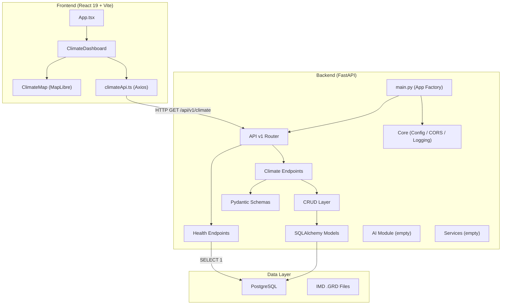
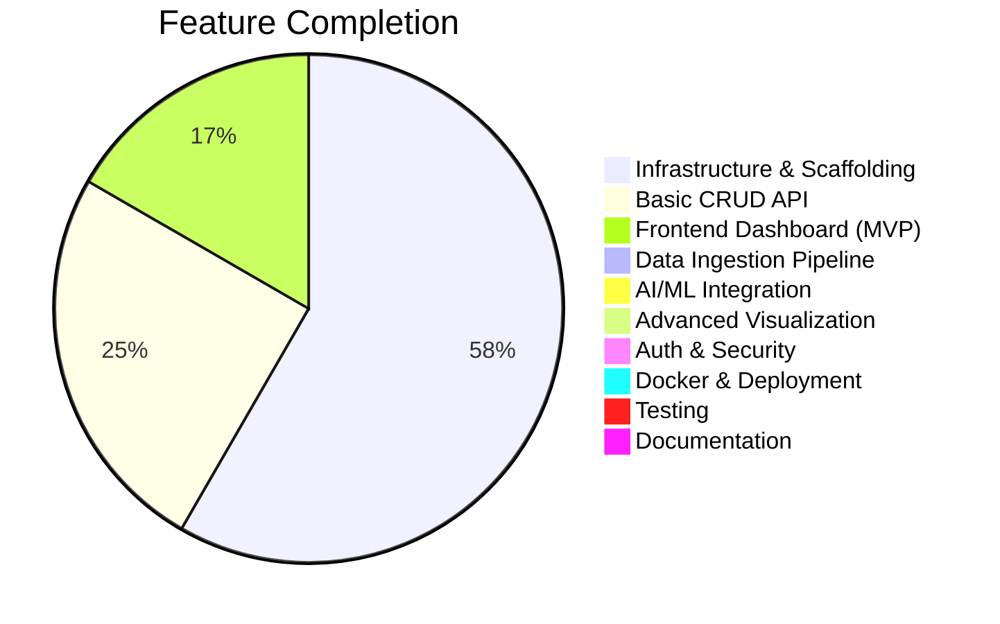

# 🌍 ClimateTwin AI — Project Analysis

**An AI-powered Digital Twin of India's Climate** — real-time simulation, prediction, and analysis engine.

---

## Project Overview

| Attribute | Value |
|---|---|
| **Project Stage** | Early Development (v0.1.0) |
| **Architecture** | Full-stack monorepo |
| **Backend** | Python / FastAPI (async) |
| **Frontend** | React 19 + TypeScript + Vite |
| **Database** | PostgreSQL (via SQLAlchemy + asyncpg) |
| **AI/ML Stack** | PyTorch, Transformers, LangChain, ChromaDB (dependencies installed, **not yet integrated**) |
| **Geospatial** | MapLibre GL, GeoPandas, Rasterio, xarray, netCDF4 |
| **Migrations** | Alembic |

---

## Architecture Diagram

---

## File-by-File Inventory

### Backend — [backend/](file:///e:/ClimateTwinAI/backend)

| File | Status | Purpose |
|---|---|---|
| [main.py](file:///e:/ClimateTwinAI/backend/app/main.py) | ✅ Implemented | App factory with lifespan, CORS, router |
| [config.py](file:///e:/ClimateTwinAI/backend/app/core/config.py) | ✅ Implemented | Pydantic settings (app, DB, CORS, AI, security) |
| [cors.py](file:///e:/ClimateTwinAI/backend/app/core/cors.py) | ✅ Implemented | CORS middleware setup |
| [logging.py](file:///e:/ClimateTwinAI/backend/app/core/logging.py) | ✅ Implemented | Structured logging with noisy-logger suppression |
| [session.py](file:///e:/ClimateTwinAI/backend/app/database/session.py) | ✅ Implemented | Async engine, session factory, `get_db` dependency |
| [base.py](file:///e:/ClimateTwinAI/backend/app/database/base.py) | ✅ Implemented | SQLAlchemy `DeclarativeBase` |
| [climate_record.py](file:///e:/ClimateTwinAI/backend/app/models/climate_record.py) | ✅ Implemented | `ClimateRecord` ORM model (lat, lon, temp, humidity, rainfall, wind) |
| [climate.py (schema)](file:///e:/ClimateTwinAI/backend/app/schemas/climate.py) | ✅ Implemented | Create / Response Pydantic schemas |
| [health.py (schema)](file:///e:/ClimateTwinAI/backend/app/schemas/health.py) | ✅ Implemented | Health & DB health response schemas |
| [climate.py (crud)](file:///e:/ClimateTwinAI/backend/app/crud/climate.py) | ✅ Implemented | `create_record`, `get_all_records`, `get_record_by_id` |
| [climate.py (endpoint)](file:///e:/ClimateTwinAI/backend/app/api/v1/climate.py) | ✅ Implemented | POST / GET / GET by ID endpoints |
| [health.py (endpoint)](file:///e:/ClimateTwinAI/backend/app/api/v1/endpoints/health.py) | ✅ Implemented | Liveness + DB readiness probes |
| [router.py](file:///e:/ClimateTwinAI/backend/app/api/v1/router.py) | ✅ Implemented | V1 router aggregator |
| [ai/\_\_init\_\_.py](file:///e:/ClimateTwinAI/backend/app/ai/__init__.py) | ❌ Empty | AI/ML integration placeholder |
| [services/\_\_init\_\_.py](file:///e:/ClimateTwinAI/backend/app/services/__init__.py) | ❌ Empty | Business logic placeholder |
| [utils/\_\_init\_\_.py](file:///e:/ClimateTwinAI/backend/app/utils/__init__.py) | ❌ Empty | Helpers placeholder |
| [inspect_grd.py](file:///e:/ClimateTwinAI/backend/scripts/inspect_grd.py) | 🔧 Script | NumPy reader for IMD `.GRD` binary files (rainfall, min/max temp) |

### Frontend — [frontend/](file:///e:/ClimateTwinAI/frontend)

| File | Status | Purpose |
|---|---|---|
| [main.tsx](file:///e:/ClimateTwinAI/frontend/src/main.tsx) | ✅ Implemented | React entry point |
| [App.tsx](file:///e:/ClimateTwinAI/frontend/src/App.tsx) | ✅ Minimal | Renders `ClimateDashboard` directly (no routing) |
| [ClimateDashboard.tsx](file:///e:/ClimateTwinAI/frontend/src/pages/ClimateDashboard.tsx) | ✅ Implemented | Dashboard with stats cards + table + map |
| [ClimateMap.tsx](file:///e:/ClimateTwinAI/frontend/src/components/ClimateMap.tsx) | ✅ Implemented | MapLibre map with color-coded temperature markers + popups |
| [climateApi.ts](file:///e:/ClimateTwinAI/frontend/src/services/climateApi.ts) | ✅ Implemented | Axios client hitting `GET /api/v1/climate` |

### Empty Placeholder Directories

| Directory | Intended Purpose |
|---|---|
| `database/` (root) | Likely for SQL seeds or migration scripts |
| `datasets/` | Climate datasets (IMD GRD files, etc.) |
| `models/` (root) | Trained ML model artifacts |
| `docker/` | Dockerfiles / docker-compose |
| `docs/` | Project documentation |
| `scripts/` (root) | Utility scripts |
| `presentation/` | Pitch/demo presentation materials |

---

## What's Working

1. **Backend API scaffold** — fully functional FastAPI app with factory pattern, lifespan hooks, versioned routing, CORS, and structured logging.
2. **Climate CRUD** — complete `POST`, `GET (all)`, `GET (by id)` flow from endpoint → CRUD → ORM → PostgreSQL.
3. **Health probes** — liveness (`/health`) and readiness (`/health/db`) endpoints suitable for container orchestration.
4. **Frontend dashboard** — displays stat cards (avg temp, rainfall, humidity, station count), a data table, and an interactive MapLibre map with temperature-colored markers.
5. **Database migrations** — Alembic is configured and ready for schema evolution.

---

## Issues & Risks Found

> [!CAUTION]
> ### 🔑 Hardcoded Database Password
> [config.py:53](file:///e:/ClimateTwinAI/backend/app/core/config.py#L53) contains `POSTGRES_PASSWORD: str = "Anchal@18"` as a default value. This password will be used if no `.env` override is set and is committed to version control.

> [!WARNING]
> ### CRUD Double-Commit
> [climate.py (crud)](file:///e:/ClimateTwinAI/backend/app/crud/climate.py#L25) calls `await db.commit()` inside `create_record`, but the `get_db` dependency in [session.py](file:///e:/ClimateTwinAI/backend/app/database/session.py#L54) also commits on success. This double-commit is harmless but indicates a confused transaction ownership pattern — pick one layer to own commits.

> [!WARNING]
> ### CRUD Indentation Bug
> In [climate.py (crud)](file:///e:/ClimateTwinAI/backend/app/crud/climate.py#L12-L21), the `ClimateRecord(...)` constructor arguments are indented at the **function** level rather than inside the constructor call. Python still interprets this correctly due to the open parenthesis, but it is misleading and error-prone.

> [!NOTE]
> ### Missing API Endpoints
> The frontend calls `GET /api/v1/climate` which is wired, but several features implied by the dependencies are not yet built:
> - No geospatial query endpoints (filter by bounding box, region)
> - No time-series query endpoints (filter by date range)
> - No AI/prediction endpoints
> - No data ingestion pipeline from `.GRD` files to DB

> [!NOTE]
> ### Frontend — No Routing
> `react-router-dom` is installed but unused. `App.tsx` renders `ClimateDashboard` directly with no router.

> [!NOTE]
> ### Frontend — Unused Dependencies
> `cesium`, `deck.gl`, `recharts`, and `tailwindcss` are installed but **not used** anywhere in the current code.

> [!NOTE]
> ### Frontend — Duplicate Interface
> `ClimateRecord` interface is defined identically in both [ClimateDashboard.tsx](file:///e:/ClimateTwinAI/frontend/src/pages/ClimateDashboard.tsx#L5-L15) and [ClimateMap.tsx](file:///e:/ClimateTwinAI/frontend/src/components/ClimateMap.tsx#L5-L15). Should be a shared type.

---

## Dependency Highlights

### Heavy AI/ML Stack (Backend) — installed but **NOT integrated**

| Package | Version | Purpose |
|---|---|---|
| `torch` | 2.12.1 | Deep learning framework |
| `transformers` | 5.12.1 | HuggingFace models |
| `langchain` | 1.3.11 | LLM orchestration |
| `langgraph` | 1.2.6 | Agent workflows |
| `chromadb` | 1.5.9 | Vector database |
| `scikit-learn` | 1.9.0 | Classical ML |
| `onnxruntime` | 1.27.0 | Model inference optimization |

### Geospatial Stack (Backend)

| Package | Version | Purpose |
|---|---|---|
| `geopandas` | 1.1.3 | Geospatial DataFrames |
| `rasterio` | 1.5.0 | Raster data (GeoTIFF) |
| `xarray` + `netCDF4` | 2026.4.0 / 1.7.4 | Multi-dimensional arrays, climate file formats |
| `shapely` | 2.1.2 | Geometric operations |

### Visualization (Frontend)

| Package | Version | Status |
|---|---|---|
| `maplibre-gl` + `react-map-gl` | 5.24.0 / 8.1.1 | ✅ Used |
| `recharts` | 3.9.0 | ❌ Unused |
| `deck.gl` | 9.3.4 | ❌ Unused |
| `cesium` | 1.142.0 | ❌ Unused |

---

## Completion Assessment

| Area | Completion | Notes |
|---|---|---|
| Backend scaffolding | ~90% | Solid foundation, well-structured |
| CRUD API | ~40% | Only basic create/read; no update/delete, no filtering |
| Frontend | ~20% | Single page, inline styles, no routing, no charts |
| Data pipeline | ~5% | Only a raw `.GRD` inspector script exists |
| AI/ML | 0% | Module exists but empty; all ML deps unused |
| Auth/Security | 0% | Secret key & JWT config exist, but no auth flow |
| Testing | 0% | No test files found |
| Docker | 0% | Empty `docker/` directory |
| Documentation | ~15% | Backend README is good; root README is empty |

---

## Recommended Next Steps

1. **🔐 Remove hardcoded password** from `config.py` — use `.env` only
2. **📥 Build a data ingestion service** — parse IMD `.GRD` files and bulk-insert into PostgreSQL
3. **🧠 Wire up the AI module** — start with a simple climate prediction model using the installed PyTorch/sklearn stack
4. **🛣️ Add routing** to the frontend — use the already-installed `react-router-dom`
5. **📊 Add charts** — use the installed `recharts` for time-series temperature/rainfall graphs
6. **🧪 Add tests** — at minimum, API endpoint tests with `pytest` + `httpx`
7. **🐳 Dockerize** — create `Dockerfile` + `docker-compose.yml` in the `docker/` directory
8. **🔄 Fix transaction pattern** — decide whether CRUD or `get_db` dependency owns commits
